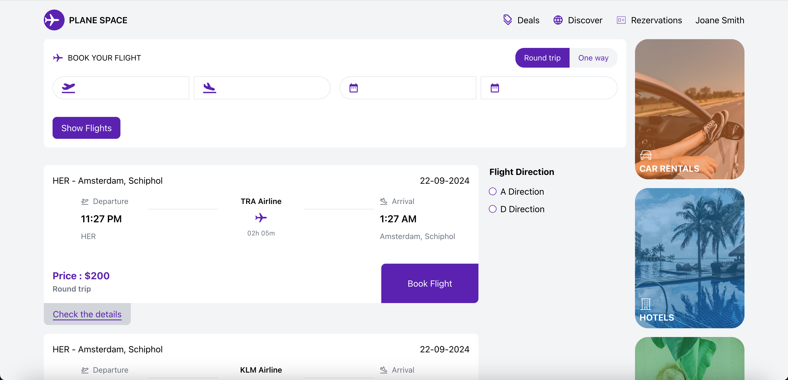
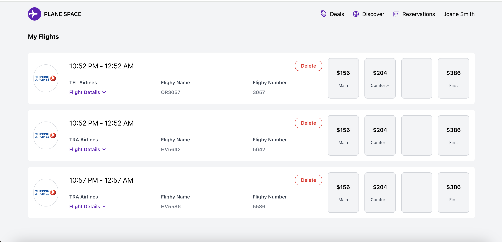
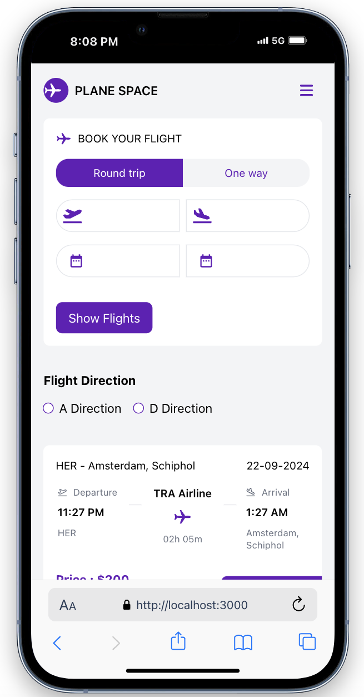
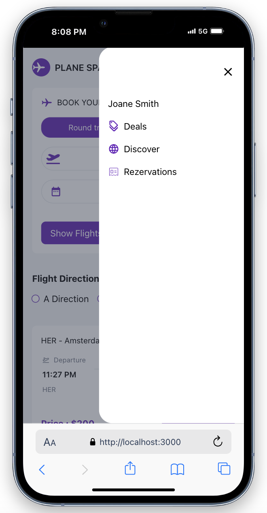

# Uçuş Rezervasyon Sistemi

Bu proje, Amsterdam Schiphol Havalimanı'na gelen ve giden uçuşların listesini görüntülemenizi, filtrelemenizi ve bu uçuşlar için rezervasyon yapmanızı sağlayan bir uçuş rezervasyon sistemidir. Proje, kullanıcıların uçuş bilgilerini sorgulamalarını, rezervasyon yapmalarını ve yapılan rezervasyonları yönetmelerini amaçlamaktadır.


## Özellikler

#### Uçuş Bilgileri Listesi
- Anasayfada uçuş bilgileri listelenir ve kullanıcılar kalkış veya varış noktası, tarih ve uçuş yönüne göre filtreleme yapabilir.

#### Dinamik Nokta Atamaları
- Kalkış noktası seçilirse iniş noktası Amsterdam olarak atanır.
- İniş noktası seçilirse kalkış noktası Amsterdam Schiphol Havalimanı olarak atanır.

#### Tarih ve Yön Filtreleme
- Uçuşlar, sadece yöne ya da hem yön hem de tarihe göre filtrelenebilir.

#### Rezervasyon Uyarısı
- Geçmiş tarihli uçuşlara rezervasyon yapılamaz.
- Geçmiş tarihli bir uçuş seçildiğinde kullanıcıya uyarı verilir.

#### Rezervasyon Yönetimi
- Kullanıcılar gelecekteki uçuşlar için rezervasyon yapabilir.
- "Rezervasyonlarım" sayfasından yapılan rezervasyonları görüntüleyebilir veya silebilir.

#### Responsive Tasarım
- Tüm cihazlarda kullanılabilirlik sağlanmıştır, mobil ve masaüstü cihazlarla uyumludur.

#### API Entegrasyonu
- Uçuş bilgileri ve kalkış-iniş noktaları, **developer.schiphol.nl** tarafından sağlanan API ile alınmaktadır.

#### Sayfalama
- API, başlangıçta 20 uçuş bilgisi sağlamaktadır ve kullanıcı işlemlerine göre daha fazla veri sayfalandırılarak yüklenir.

#### Backend Entegrasyonu
- Node.js ile oluşturulmuş backend sistemi aracılığıyla rezervasyon kaydetme, listeleme ve silme işlemleri MongoDB üzerinde gerçekleştirilir.

#### Redux ile Veri Yönetimi
- Uygulamanın genel veri yönetimi Redux kullanılarak sağlanmıştır.
- API'den alınan veriler Redux store'a kaydedilir ve gerekli durumlarda veriler güncellenir.

## Kullandığım Teknolojiler

### Frontend
- 🟢 React
- 🔄 Redux
- 🛣️ React Router
- 🎨 Tailwind CSS
- 📦 Axios

### Backend
- 🖥️ Express
- 🗄️ Mongoose
- ⚙️ Dotenv

## Projeyi Başlatmak İçin Adımlar

1. **Projeyi Klonlayın**
   - Depoyu yerel makinenize klonlayın.
     ```bash
     git clone https://github.com/Semanur-Arslan/PlaneSpace.git
     ```

2. **Backend Dizini**
   - Terminalde backend dizinine gidin:
     ```bash
     cd backend
     ```

3. **Modülleri Yükleyin**
   - Gerekli modülleri yüklemek için aşağıdaki komutu çalıştırın:
     ```bash
     npm install
     ```

4. **.env Dosyasını Güncelleyin**
   - `example.env` dosyasını `.env` olarak yeniden adlandırın.

5. **MongoDB Veritabanı Oluşturun**
   - MongoDB'de `planeSpaceDb` adında bir veritabanı oluşturun.

6. **Backend'i Başlatın**
   - Backend sunucusunu başlatmak için aşağıdaki komutu kullanın:
     ```bash
     node server.js
     ```

7. **Frontend Dizini**
   - Farklı bir terminal açarak frontend dizinine gidin:
     ```bash
     cd frontend
     ```

8. **Modülleri Yükleyin**
   - Frontend için gerekli modülleri yüklemek için:
     ```bash
     npm install
     ```

9. **Frontend'i Başlatın**
   - Uygulamayı başlatmak için aşağıdaki komutu çalıştırın:
     ```bash
     npm run start
     ```

## Proje Görüntüleri

<div>
  
  
</div>

<div>
  
  
  
</div>


